# Giulia Technical Manual Assistant

A multimodal Retrieval-Augmented Generation (RAG) system that answers technical questions about the Alfa Romeo Giulia using the official owner's manual as its only source of truth. A Colab-hosted FastAPI service performs vector retrieval over a ChromaDB index built from a 360-page PDF, generates grounded answers with local Ollama models, and returns page-level citations plus manual page images. A zero-dependency static frontend presents this as a branded chat interface alongside a marketing site, vehicle configurator, and photo gallery.

> **Scope note.** This README was reverse-engineered from the files present in this repository snapshot: `Giulia_RAG_manual.ipynb`, `app.js`, `index.html`, `home.html`, `configurator.html`, and `gallery.html`. Several files are *referenced* by that code but are not present in the snapshot (`styles.css`, `brand.css`, `nav.js`, `trim-data.js`, the `images/` tree, and the backend `main.py` as a standalone file). Statements about those files are marked **Not verified from repository**.

---

## Table of Contents

- [Overview](#overview)
- [Problem Statement](#problem-statement)
- [Key Features](#key-features)
- [System Architecture](#system-architecture)
  - [High-Level Architecture](#a-high-level-architecture)
  - [Component Architecture](#b-component-architecture)
  - [End-to-End Data Flow](#c-end-to-end-data-flow)
  - [Request Lifecycle](#d-request-lifecycle)
  - [RAG / AI Pipeline](#e-rag--ai-pipeline)
  - [Query Processing Stages](#f-query-processing-stages)
  - [Deployment Architecture](#g-deployment-architecture)
  - [Sequence Diagrams](#h-sequence-diagrams)
- [Technology Stack](#technology-stack)
- [Project Structure](#project-structure)
- [Component Deep Dive](#component-deep-dive)
  - [Ingestion: PDF Parsing and Image Extraction](#1-ingestion-pdf-parsing-and-image-extraction)
  - [Chunking and Metadata](#2-chunking-and-metadata)
  - [Embeddings and Vector Store](#3-embeddings-and-vector-store)
  - [Page Rasterization and Metadata Backfill](#4-page-rasterization-and-metadata-backfill)
  - [Backend Service](#5-backend-service-mainpy)
  - [Frontend Assistant](#6-frontend-assistant-appjs--indexhtml)
  - [Marketing Pages](#7-marketing-pages)
- [Data Model](#data-model)
- [API Documentation](#api-documentation)
- [Installation and Setup](#installation-and-setup)
- [Configuration](#configuration)
- [Usage](#usage)
- [Engineering Decisions](#engineering-decisions)
- [Testing and Evaluation](#testing-and-evaluation)
- [Performance and Scalability](#performance-and-scalability)
- [Security and Reliability](#security-and-reliability)
- [Known Issues and Bugs](#known-issues-and-bugs)
- [Current Limitations](#current-limitations)
- [Future Improvements](#future-improvements)
- [Contributing](#contributing)
- [License](#license)
- [Acknowledgments](#acknowledgments)

---

## Overview

The system has three distinct layers, built and run in different places:

| Layer | Where it lives | How it runs |
|---|---|---|
| **Ingestion + indexing** | `Giulia_RAG_manual.ipynb` | Executed once in Google Colab; artifacts persisted to Google Drive |
| **Inference API** | `main.py`, generated *by* the notebook at runtime | `uvicorn` inside the Colab VM, exposed publicly via an ngrok tunnel |
| **Frontend** | `index.html`, `app.js`, plus three marketing pages | Static files; no build step, no bundler, no framework |

The backend is not a checked-in source file. The notebook writes `main.py` to Drive as a Python string literal and then launches `uvicorn` against it. Two successive notebook cells write two different revisions of that file; the **final** revision (the `llava:13b` figure-analysis build) is the one documented here.

**Verified corpus statistics**, taken from stored notebook cell outputs:

| Metric | Value | Source |
|---|---|---|
| PDF pages processed | 360 | Cell 2 output |
| Pages yielding non-empty text | 356 | Cell 2 output |
| Text chunks created | 1,561 | Cell 3 output |
| Embedding batches inserted | 4 (batch size 500) | Cell 3 output |
| Chroma collection name | `alfa_romeo_manual` | Cell 3 source |

The `356 Pages Indexed` badge rendered in `index.html` matches the verified extraction count.

---

## Problem Statement

A 360-page automotive owner's manual is a poor interface for a specific question. Tire pressure tables, DNA drive-mode procedures, warning-light legends, and fluid specifications are scattered across sections, and a full-text search returns page hits rather than answers.

This project addresses that by:

1. Making the manual **semantically searchable** rather than keyword-searchable.
2. **Grounding** every generated answer in retrieved manual text, with an explicit refusal instruction when the context is insufficient.
3. Returning the **source page image** next to the answer, so the user can verify the claim against the original document.
4. Supporting **visual questions** — a user can upload a dashboard photo, or ask about a diagram, and route to a vision model.

---

## Key Features

**Implemented and verified in code:**

- Page-aware PDF text extraction with column-order block sorting and header/page-number filtering.
- Per-page embedded image extraction from the PDF.
- Recursive character chunking with overlap and page metadata attached to every chunk.
- Persistent ChromaDB vector store with `all-MiniLM-L6-v2` embeddings.
- Full-page PNG rasterization at 150 DPI for citation imagery.
- FastAPI service with `/health` and `/query`, plus two static mounts serving manual imagery.
- Grounding system prompt with a literal refusal string for out-of-context questions.
- Automatic model routing: text model by default, vision model when an image is uploaded or when the question requests a visual explanation.
- Multi-question input heuristic that isolates the final question in a compound prompt.
- Frontend chat with typing indicator, XSS-escaped markdown-lite rendering, health polling, image upload, deep-linked questions, figure lightbox, and contextual follow-up suggestions.
- A four-mode DNA theme system that re-skins the entire interface via CSS custom properties.

---

## System Architecture

### A. High-Level Architecture

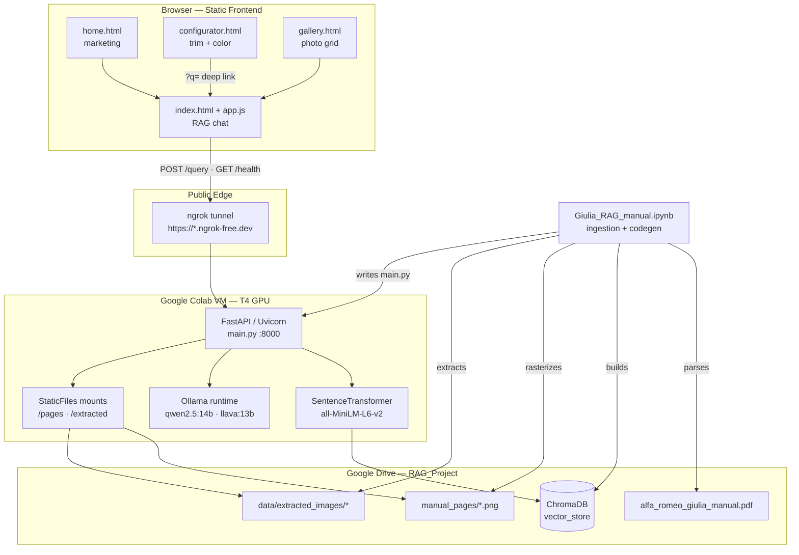

### B. Component Architecture

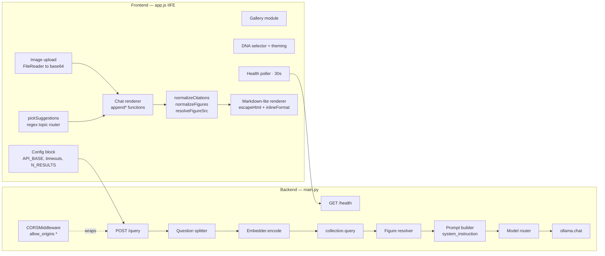

### C. End-to-End Data Flow

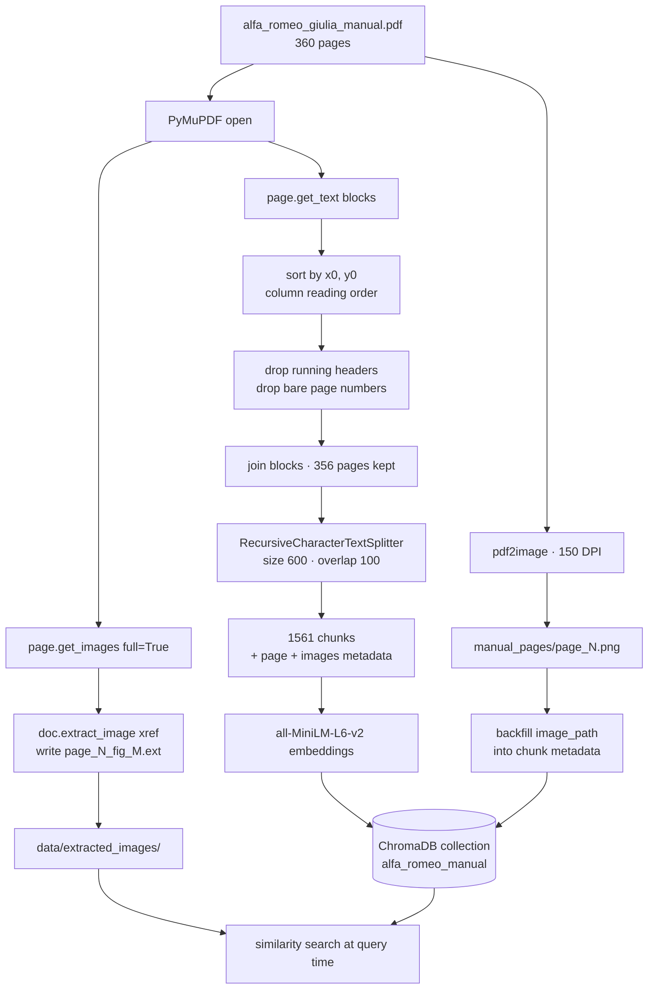

### D. Request Lifecycle

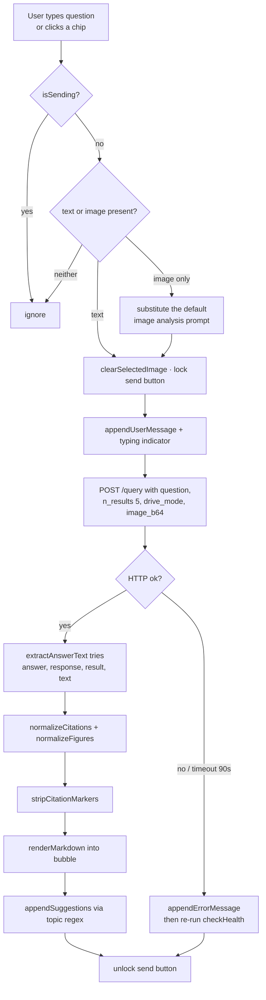

### E. RAG / AI Pipeline

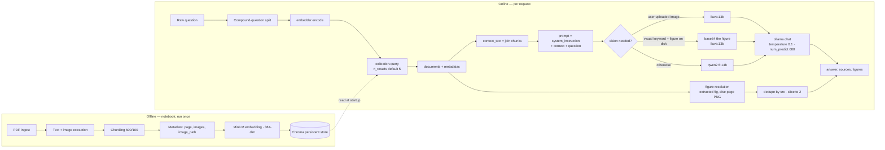

### F. Query Processing Stages

The backend's actual stage order. Note that **language detection, sentiment analysis, and trained intent classification are not implemented** — routing is performed by a literal keyword membership test.

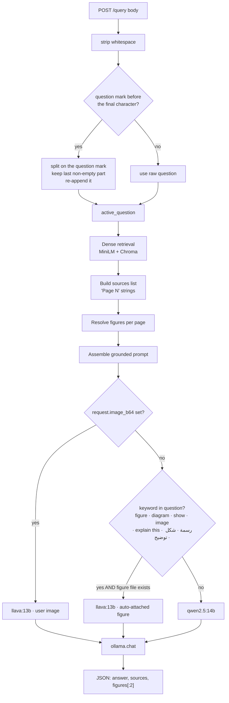

### G. Deployment Architecture

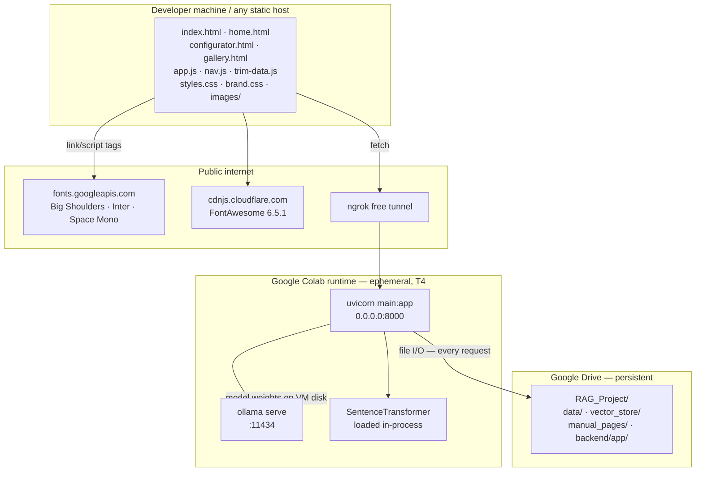

> The Colab runtime is ephemeral. When it recycles, the ngrok URL changes and `API_BASE` in `app.js` must be edited by hand.

### H. Sequence Diagrams

**H1 — Text question, grounded answer**

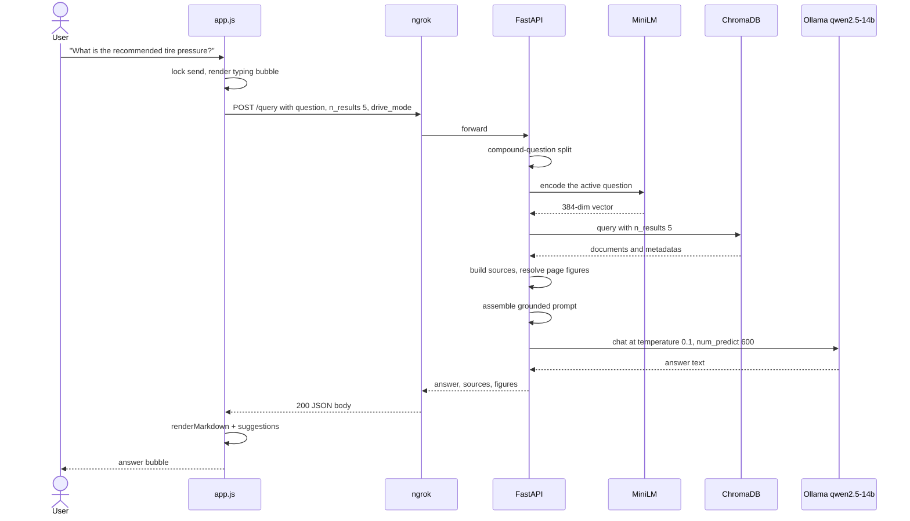

**H2 — Image upload routed to the vision model**

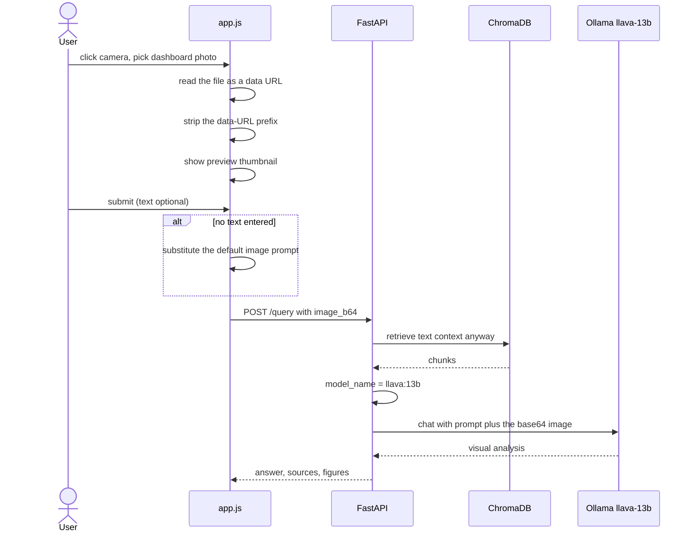

**H3 — Auto-attached figure analysis (no user upload)**

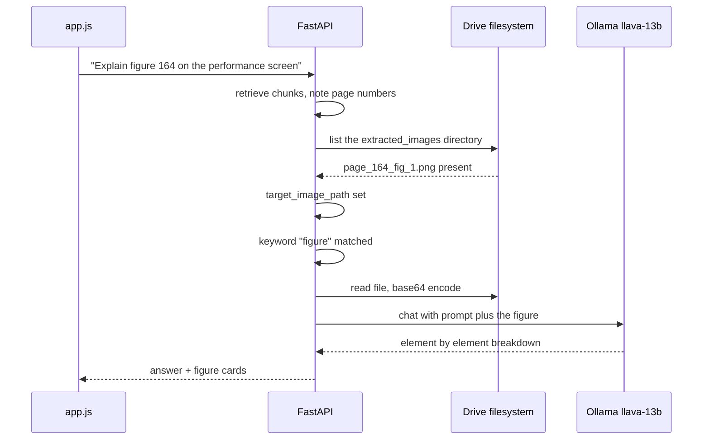

**H4 — Health polling and failure handling**

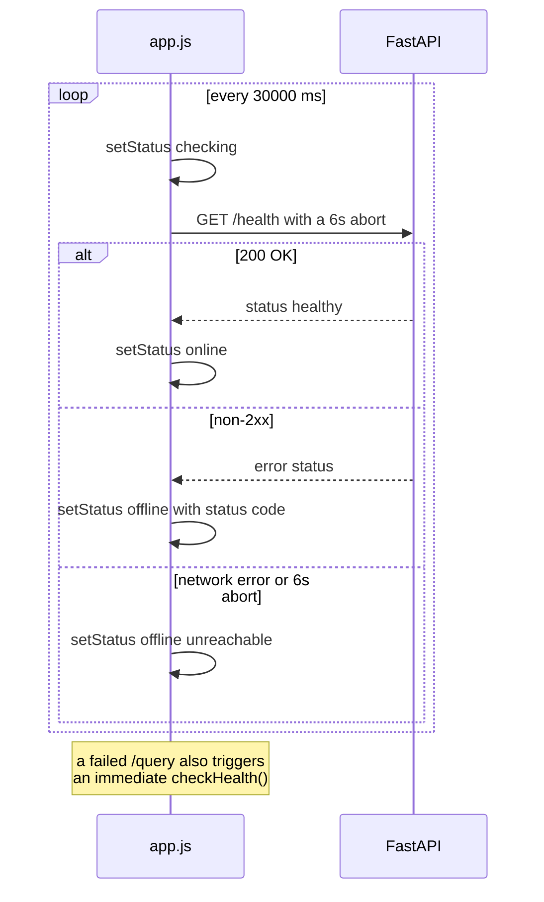

---

## Technology Stack

Only technologies actually imported, installed, or linked in the repository are listed.

### Languages
- **Python 3** — ingestion notebook and backend. Colab output shows `python3.13` site-packages.
- **JavaScript (ES6+)** — frontend logic, no transpilation.
- **HTML5 / CSS3** — four static pages; CSS custom properties drive runtime theming.

### AI / ML
| Component | Choice | Where |
|---|---|---|
| Embedding model | `all-MiniLM-L6-v2` (sentence-transformers) | Ingestion and query-time |
| Primary LLM | `qwen2.5:14b` via Ollama | Text answers |
| Vision LLM | `llava:13b` via Ollama | Image and figure analysis |
| Earlier LLM | `llama3.2` via Ollama | Notebook prototype pipeline only |
| Vision LLM (superseded) | `llama3.2-vision` | Referenced in the first `main.py` revision, replaced by `llava:13b` |

### Vector Store
- **ChromaDB** — `PersistentClient`, collection `alfa_romeo_manual`.

### Document Processing
- **PyMuPDF (`pymupdf`)** — text block and embedded image extraction.
- **`langchain-text-splitters`** — `RecursiveCharacterTextSplitter`.
- **`pdf2image` + `poppler-utils`** — page-to-PNG rasterization.

### Backend
- **FastAPI** — `app = FastAPI(title="Alfa Romeo Multimodal RAG")`
- **Uvicorn** — ASGI server
- **Pydantic** — `QueryRequest` model
- **`ollama`** Python client
- **`fastapi.staticfiles.StaticFiles`** — `/pages` and `/extracted` mounts
- **`CORSMiddleware`**

### Frontend
- Vanilla JS, no framework, no bundler, no `package.json`
- **FontAwesome 6.5.1** via cdnjs, SRI-pinned
- **Google Fonts** — Big Shoulders Display, Inter, Space Mono
- Inline SVG heraldic crest and data-URI favicon

### Infrastructure
- **Google Colab** (T4 GPU accelerator per notebook metadata)
- **Google Drive** — persistence layer for PDF, vector store, and page images
- **pyngrok** — public HTTPS tunnel to the Colab VM

### Not present in this repository
No `requirements.txt`, `package.json`, `Dockerfile`, `docker-compose.yml`, `.env.example`, CI/CD configuration, linter config, or test suite. Dependencies exist only as inline `!pip install` commands inside the notebook.

---

## Project Structure

**Files present in this snapshot:**

```
.
├── Giulia_RAG_manual.ipynb      # Ingestion, indexing, evaluation harness,
│                                # and runtime codegen for the backend
├── index.html                   # RAG chat assistant page
├── app.js                       # All assistant logic (~845 lines, single IIFE)
├── home.html                    # Marketing landing page
├── configurator.html            # Trim + color configurator (inline <script>)
└── gallery.html                 # Filterable photo gallery (inline <script>)
```

**Files referenced by the above but absent from the snapshot** — *Not verified from repository*:

```
├── styles.css                   # Layout, chat, sidebar, modal styles
├── brand.css                    # Alfa Romeo tokens, DNA mode theming
├── nav.js                       # Shared nav toggle; likely defines
│                                #   alfaAttachImageFallback()
├── trim-data.js                 # Defines ALFA_TRIMS, ALFA_DETAIL_GALLERY,
│                                #   alfaGetActiveTrim(), alfaSetActiveTrim()
└── images/
    ├── qv/qvfront.jpg           # Referenced in home.html
    ├── interior/interior.jpg    # Referenced in app.js
    ├── exterior/wheels.jpg      # Referenced in app.js
    └── giulia-*.jpg             # Referenced in index.html static markup
```

**Runtime layout on Google Drive** — created by the notebook, not version-controlled:

```
/content/drive/MyDrive/RAG_Project/
├── data/
│   ├── alfa_romeo_giulia_manual.pdf
│   ├── extracted_images/        # page_{N}_fig_{M}.{ext}
│   └── manual_pages/            # fallback location for page PNGs
├── manual_pages/                # page_{N}.png, 150 DPI — primary location
├── vector_store/                # ChromaDB persistent directory
├── backend/app/
│   └── main.py                  # Written by notebook cells at runtime
└── evaluation_results.csv       # Written by the evaluation cell
```

### Contract between `trim-data.js` and the pages

`trim-data.js` is not in the snapshot, but its shape is fully determined by consumer code across four files:

```js
ALFA_TRIMS = {
  <id>: {                    // id ∈ {giulia, quadrifoglio, gtam}
    id, name, tagline,
    hp, zeroHundred, topSpeed,
    drivetrain, colorName,
    swatch, swatchDark,      // hex, written into --accent-500 / --accent-600
    images: { front, side, rear }
  }
}
ALFA_DETAIL_GALLERY = [ { src, label, group } ]   // group ∈ exterior|interior|performance|spec
alfaGetActiveTrim()  -> string id
alfaSetActiveTrim(id)                              // dispatches "alfa:trim-change"
alfaAttachImageFallback(imgElement)                // inline-SVG placeholder on error
```

The three trim IDs are pinned by `DNA_TRIM_MAP` / `TRIM_DNA_MAP` in `app.js`.

---

## Component Deep Dive

### 1. Ingestion: PDF Parsing and Image Extraction

**Source:** `Giulia_RAG_manual.ipynb`, cell 2 — `extract_structured_page_data(pdf_path, max_pages=None)`

For each page, the function does two things:

**Embedded images.** `page.get_images(full=True)` returns image xrefs; `doc.extract_image(xref)` yields raw bytes plus the native extension. Files are written as `page_{N}_fig_{M}.{ext}` — a naming convention the backend later depends on via a `startswith(f"page_{page_num}_")` prefix match.

**Text.** `page.get_text("blocks")` returns block tuples. They are sorted by `(b[0], b[1])` — that is, **x-coordinate first, then y**. This is a deliberate choice for the manual's multi-column layout: sorting x-first reads the full left column top-to-bottom before moving to the right column, which is correct for column-major documents and wrong for single-column prose. Blocks are then filtered:

```python
if "GETTING TO KNOW YOUR CAR" in text or "STARTING AND DRIVING" in text or text.isdigit():
    continue
```

This strips running section headers and isolated page numbers, both of which would otherwise pollute chunks with high-frequency, low-information tokens that degrade embedding quality.

Pages with no surviving text are dropped entirely — 360 pages in, **356 out**.

**Returns:** `[{"page": int, "text": str, "images": [path, ...]}]`

**Table handling:** none. `get_text("blocks")` flattens tabular content into plain text blocks. There is no table detection, no cell-structure preservation, and no markdown-table reconstruction. Specification tables — tire pressures, fluid capacities — survive only as loose whitespace-separated runs of text. This is the single largest fidelity gap in the ingestion pipeline.

### 2. Chunking and Metadata

**Source:** cell 3

```python
RecursiveCharacterTextSplitter(
    chunk_size=600,
    chunk_overlap=100,
    length_function=len,
    separators=["\n\n", "\n", ".", " ", ""]
)
```

Splitting is applied **per page**, never across pages. This is what makes page citation sound: a chunk can only ever originate from one page, so `metadata["page"]` is never ambiguous.

Per chunk:

| Field | Value |
|---|---|
| `id` | `doc_page_{page}_chunk_{counter}` — counter is global, so IDs are unique |
| `metadata.page` | integer page number |
| `metadata.images` | comma-joined extracted-image paths, or the literal string `"none"` |
| `metadata.image_path` | added later by the backfill cell |

Result: **1,561 chunks** from 356 pages, roughly 4.4 chunks per page.

### 3. Embeddings and Vector Store

**Ingestion side** uses Chroma's built-in wrapper:

```python
embedding_functions.SentenceTransformerEmbeddingFunction(model_name="all-MiniLM-L6-v2")
collection = client.get_or_create_collection(name="alfa_romeo_manual", embedding_function=...)
```

Documents are inserted in batches of 500 — four batches — to bound peak memory in the Colab VM.

**Query side** does *not* use the collection's embedding function. `main.py` loads `SentenceTransformer("all-MiniLM-L6-v2")` directly and passes precomputed `query_embeddings`. Both paths use the same checkpoint, so the vector spaces match; but the coupling is implicit rather than enforced, and changing the model in one place silently corrupts retrieval.

### 4. Page Rasterization and Metadata Backfill

Two later cells add citation imagery:

**Rasterization** (`pdf2image.convert_from_path(PDF_PATH, dpi=150)`) writes `manual_pages/page_{N}.png` for every page. The cell also includes a fallback that scans `data/` for any `.pdf` if the expected filename is missing.

**Backfill** copies the entire `vector_store` directory from Drive to `/tmp` before opening it, works locally, then copies it back — an explicit workaround for Google Drive's FUSE layer, which does not support the file locking SQLite requires. Without it, ChromaDB raises disk I/O errors. It then does `collection.get()`, sets `meta['image_path'] = f"manual_pages/page_{page_num}.png"` on all 1,561 records, and issues a single bulk `collection.update()`.

> **Latent bug in this cell:** its collection fallback name is `"alfa_giulia_manual"`, but the collection created in cell 3 is `"alfa_romeo_manual"`. The fallback only fires when `list_collections()` returns empty, in which case `get_collection` would raise anyway — so it is currently harmless, but the name is wrong.

### 5. Backend Service (`main.py`)

Generated as a string literal by the notebook and written to `RAG_Project/backend/app/main.py`. Documented here from the **final** revision.

**Startup, executed once at import:**

```python
app.mount("/pages", StaticFiles(directory=PAGES_DIR), name="pages")
app.mount("/extracted", StaticFiles(directory=EXTRACTED_IMG_DIR), name="extracted")  # conditional
chroma_client = chromadb.PersistentClient(path=VECTOR_STORE_PATH)
collection = chroma_client.get_collection(name="alfa_romeo_manual")
embedder = SentenceTransformer("all-MiniLM-L6-v2")
```

`PAGES_DIR` tries `RAG_Project/manual_pages` and falls back to `RAG_Project/data/manual_pages`. `/extracted` is mounted only if the directory exists — meaning a figure `src` of `/extracted/...` can be emitted while the route is absent, yielding a 404.

**`/query` processing order:**

1. **Compound-question split.** If `"?"` appears anywhere before the final character, the string is split on `"?"` and the *last* non-empty fragment is kept. `"How do I check oil? And coolant?"` reduces to `"And coolant?"`. This trades multi-intent support for retrieval precision.
2. **Encode** the active question to a 384-dimension vector.
3. **Retrieve** `n_results` (default 5) nearest chunks.
4. **Build sources** as `"Page {N}"` strings, deduplicated with `list(set(...))` — which does not preserve order or sort numerically.
5. **Resolve figures.** Per retrieved page: prefer an extracted figure whose filename starts with `page_{N}_`; otherwise fall back to the full-page PNG from `metadata['image_path']`. Deduplicated by `src`, then truncated to the first two.
6. **Assemble the grounded prompt** — system instruction, then `Context from manual:`, then the user question.
7. **Route the model** (see below).
8. **Generate** with `temperature=0.1, num_predict=600`.

**Grounding instruction** (final revision, paraphrased): act as an Alfa Romeo chief engineer and technical illustrator; analyze the provided context and figures; when asked about a diagram or component layout, decompose its visual parts and explain what each label represents; use bullet points; and if the information is absent, emit exactly `I cannot find this information in the manual.`

That literal refusal string is the primary hallucination control. The earlier revision's instruction was blunter — *"Never assume, extrapolate beyond technical facts, or hallucinate specs"* — and the final revision softened it in favor of figure-analysis capability.

**Model routing:**

```python
is_requesting_visual = any(k in active_question.lower() for k in
    ["figure", "diagram", "show", "image", "explain this", "رسمة", "شكل", "توضيح"])

model_name = "qwen2.5:14b"
if request.image_b64:
    model_name = "llava:13b"                      # user-supplied image wins
elif target_image_path and os.path.exists(target_image_path) and is_requesting_visual:
    image_payload_b64 = base64.b64encode(open(target_image_path,"rb").read()).decode()
    model_name = "llava:13b"                      # auto-attach the retrieved figure
```

The keyword list mixes English and Arabic terms. Note that `"show"` is a substring match, so `"showroom"` or `"shows"` also trigger vision routing.

**Error handling:** the entire handler sits in one `try/except Exception` that re-raises as `HTTPException(status_code=500, detail=str(e))`. Internal exception text — including filesystem paths — is returned to the client.

### 6. Frontend Assistant (`app.js` + `index.html`)

A single IIFE under `"use strict"`, roughly 845 lines, organized into labeled sections. No module system, no framework.

**Configuration constants:**

| Constant | Value | Purpose |
|---|---|---|
| `API_BASE` | hardcoded ngrok HTTPS URL | Backend origin |
| `HEALTH_POLL_MS` | `30000` | Health check interval |
| `REQUEST_TIMEOUT_MS` | `90000` | Query abort threshold |
| `N_RESULTS` | `5` | Chunks requested per query |

**Markdown-lite renderer.** `escapeHtml` runs **before** any formatting, so model output cannot inject HTML. It then supports `**bold**`, backtick `code`, `-`/`*`/`•` bullet lists, and double-newline paragraph blocks. `<br>` for single newlines within a block. This ordering is the correct one — escape first, then add markup — and is the frontend's main security control.

**Response normalization.** The frontend is defensive about backend shape. `extractAnswerText` accepts `answer`, `response`, `result`, `text`, or a bare string. `normalizeCitations` reads `payload.sources[].page`, `payload.citations[]`, and inline `[Source: Page N]` markers. `normalizeFigures` reads `image_url`, `image`, or `figure_url`. `resolveFigureSrc` prefixes relative paths with `API_BASE` and leaves absolute URLs and data URIs alone. See [Known Issues](#known-issues-and-bugs) — two of these normalizers do not match what the backend actually emits.

**DNA drive-mode system.** Four modes set `document.documentElement.setAttribute("data-mode", mode)`, which flips CSS custom properties site-wide. Selecting a mode also calls `alfaSetActiveTrim()` via `DNA_TRIM_MAP` (`dynamic`→quadrifoglio, `natural`/`advanced`→giulia, `race`→gtam), swapping the sidebar photography. The reverse map keeps the pills in sync when a trim is changed elsewhere. `syncDnaPillUI` early-returns when the mode is unchanged, which prevents an infinite event loop between the two maps.

**Follow-up suggestions.** `pickSuggestions` routes the question through an ordered regex chain into one of six curated pools (`tire`, `oil`, `drive`, `maintenance`, `cockpit`, `general`) and returns three. Pools are static; nothing is generated.

**Image upload.** `FileReader.readAsDataURL`, then `String(dataUrl).split(",")[1]` to strip the MIME prefix and keep raw base64. No client-side size limit, no dimension check, no MIME allowlist beyond the input's `accept="image/*"`.

**Deep linking.** On load, `?q=` is read from the query string, `history.replaceState` clears it from the address bar, and the question is submitted automatically. `configurator.html` uses this to hand a trim-specific question to the assistant.

**Concurrency guard.** `state.isSending` blocks overlapping submissions; the send button is disabled for the duration and re-enabled in a `finally` block.

### 7. Marketing Pages

| Page | Logic | Notes |
|---|---|---|
| `home.html` | Inline IIFE | Renders trim strip and a 7-item preview grid from `ALFA_DETAIL_GALLERY.slice(0, 7)`; `applyHero` swaps hero image, stats, tagline, and accent CSS variables on `alfa:trim-change` |
| `configurator.html` | Inline IIFE | Trim list, color swatches, spec table, and three camera angles (`front`/`side`/`rear`); the CTA builds an `index.html?q=...` deep link with `encodeURIComponent` |
| `gallery.html` | Inline IIFE | `buildEntries()` merges `ALFA_DETAIL_GALLERY` with three angles × three trims; six filters; lightbox with backdrop-click and `Escape` close |

All four pages share the same `<nav class="site-nav">` markup and a `data-page` attribute on `<body>`.

> `configurator.html` displays *"Configurazione salvata in locale"* for 1.8 seconds after a change, but **no persistence call is present in the file**. Any actual saving would have to live in `alfaSetActiveTrim()` inside the missing `trim-data.js`. **Not verified from repository.**

---

## Data Model

There is no relational database. The only persisted structured data is the ChromaDB collection.

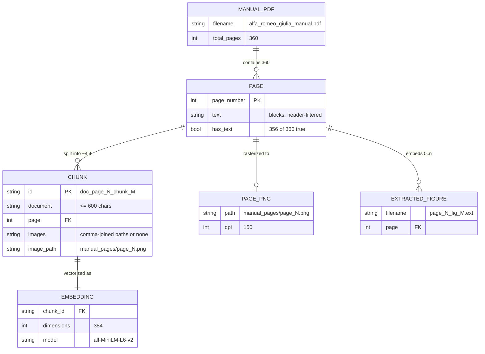

---

## API Documentation

**Base URL:** the active ngrok tunnel, e.g. `https://<subdomain>.ngrok-free.dev`. Locally: `http://127.0.0.1:8000`.

**Authentication:** none. All endpoints are unauthenticated.

**CORS:** `allow_origins=["*"]`, `allow_credentials=True`, all methods, all headers.

### `GET /health`

Liveness probe. No parameters.

```json
{ "status": "healthy" }
```

`200` on success. A crashed startup — missing vector store, missing collection — means the process never binds, so the request fails at the transport layer rather than returning an error body.

### `POST /query`

**Request body** (`QueryRequest`):

| Field | Type | Default | Required |
|---|---|---|---|
| `question` | `str` | — | yes |
| `n_results` | `int` | `5` | no |
| `image_b64` | `str \| None` | `None` | no |

The frontend also sends `drive_mode`. It is **not** declared on the Pydantic model and is silently discarded — Pydantic's default behavior for unknown fields. The DNA selector therefore has no effect on retrieval or generation; it is purely a visual theme.

```json
{
  "question": "What is the recommended tire pressure for normal load?",
  "n_results": 5
}
```

**Response `200`:**

```json
{
  "answer": "- Front tires: ...\n- Rear tires: ...",
  "sources": ["Page 214", "Page 215"],
  "figures": [
    { "src": "/pages/page_214.png", "caption": "Alfa Romeo Manual · Page 214" }
  ]
}
```

| Field | Type | Notes |
|---|---|---|
| `answer` | `str` | Model output; bullet-structured by prompt instruction |
| `sources` | `string[]` | `"Page N"` strings via `list(set(...))` — unordered |
| `figures` | `object[]` | At most 2; `src` is a relative path needing the API origin prefixed |

**Response `500`:**

```json
{ "detail": "<str(exception)>" }
```

Every failure path — retrieval, filesystem, Ollama — collapses into this single shape.

### Static Routes

| Route | Serves | Mounted |
|---|---|---|
| `GET /pages/{filename}` | Full-page manual PNGs | Always |
| `GET /extracted/{filename}` | Figures extracted from the PDF | Only if the directory exists |

### `curl` examples

*Illustrative — response bodies are not verified outputs.*

```bash
curl http://127.0.0.1:8000/health

curl -X POST http://127.0.0.1:8000/query \
  -H "Content-Type: application/json" \
  -d '{"question":"How do I check the engine coolant level?","n_results":5}'

# With an image (vision routing)
B64=$(base64 -w0 dashboard.jpg)
curl -X POST http://127.0.0.1:8000/query \
  -H "Content-Type: application/json" \
  -d "{\"question\":\"What warning light is this?\",\"image_b64\":\"$B64\"}"
```

Through ngrok, add `-H "ngrok-skip-browser-warning: true"` — the frontend already sends this header.

---

## Installation and Setup

### Prerequisites

- A Google account with Drive space for the PDF, vector store, and ~360 page PNGs.
- Google Colab. The notebook declares a **T4 GPU** accelerator; `qwen2.5:14b` and `llava:13b` are large enough that CPU-only inference will be extremely slow.
- An ngrok account and auth token for public exposure.
- Any static file server for the frontend.
- The manual PDF, which is **not included in this repository**. Place it at `RAG_Project/data/alfa_romeo_giulia_manual.pdf`.

> Python and Node version constraints are not pinned anywhere in the repository. Colab output shows `python3.13`. **Not verified from repository.**

### Backend — first run

Run the notebook cells in order:

1. **Mount Drive and set paths** — creates `RAG_Project/data/extracted_images/`.
2. **Install ingestion dependencies:**
   ```bash
   pip install -q PyMuPDF chromadb sentence-transformers langchain-text-splitters
   ```
3. **Extract** — parses all pages, writes figures. Expect `Total valid pages extracted: 356`.
4. **Chunk and embed** — expect `Total chunks created: 1561` and four insert batches.
5. **Install Ollama:**
   ```bash
   apt-get update && apt-get install -y zstd
   curl -fsSL https://ollama.com/install.sh | sh
   ```
6. **Rasterize pages:**
   ```bash
   apt-get install -y poppler-utils && pip install --upgrade pdf2image
   ```
   Then run the `convert_from_path(..., dpi=150)` cell.
7. **Backfill `image_path` metadata** — the `/tmp` copy-modify-copy-back cell. Required, or figures will not resolve.
8. **Run the final backend cell** — pulls `llava:13b`, writes `main.py`, starts uvicorn, opens the ngrok tunnel and prints the public URL.

> Before running the final cells, **replace the hardcoded `NGROK_TOKEN` with your own** and read [Security](#security-and-reliability) first.

### Backend — reconnecting after a Colab restart

The notebook has a dedicated reconnection cell. Vector store and page images survive on Drive; the VM does not.

```bash
pip install -q ollama chromadb sentence-transformers langchain-text-splitters \
               fastapi uvicorn pyngrok pydantic
```

Then re-run Ollama startup, the model pull, and the uvicorn launch. The ngrok URL will be different.

### Frontend

The frontend expects five files that are not in this snapshot (`styles.css`, `brand.css`, `nav.js`, `trim-data.js`, `images/`). Without them the pages load but render unstyled and throw `ReferenceError: ALFA_TRIMS is not defined`.

> **TODO: Verify required configuration.** Restore or author the missing static assets before serving.

```bash
python3 -m http.server 5500
```

Then open `http://localhost:5500/home.html`. Opening via `file://` will fail on CORS for the API calls.

### Running tests

No test suite exists. The notebook's evaluation cell is the closest equivalent — see [Testing and Evaluation](#testing-and-evaluation).

---

## Configuration

There is no configuration file, no environment variable loading, and no `.env` support. All configuration is hardcoded.

| Setting | Location | Current value |
|---|---|---|
| `API_BASE` | `app.js` line 12 | Hardcoded ngrok HTTPS URL |
| `N_RESULTS` | `app.js` | `5` |
| `REQUEST_TIMEOUT_MS` | `app.js` | `90000` |
| `HEALTH_POLL_MS` | `app.js` | `30000` |
| `BASE_DIR` | notebook + `main.py` | `/content/drive/MyDrive/RAG_Project` |
| `VECTOR_STORE_PATH` | `main.py` | `{BASE_DIR}/vector_store` |
| Collection name | `main.py` | `alfa_romeo_manual` |
| Embedding model | notebook + `main.py` | `all-MiniLM-L6-v2` |
| Text model | `main.py` | `qwen2.5:14b` |
| Vision model | `main.py` | `llava:13b` |
| `temperature` | `main.py` | `0.1` |
| `num_predict` | `main.py` | `600` |
| `chunk_size` / `chunk_overlap` | notebook | `600` / `100` |
| Rasterization DPI | notebook | `150` |
| `NGROK_TOKEN` | notebook | **Hardcoded literal — must be rotated** |

**After every Colab restart, `API_BASE` in `app.js` must be manually updated to the new ngrok URL.** This is the most frequent operational failure.

---

## Usage

### Asking a question

Open `index.html`. The status dot in the sidebar reports `/health` state — wait for green before asking. Then either:

- Type a question and press **Enter** (Shift+Enter inserts a newline).
- Click a **Quick Reference** chip in the sidebar.
- Click a **feature card** on the empty state.
- Click a **suggestion chip** after any answer.

Three answer-affecting behaviors are worth knowing:

- Asking two questions in one message returns an answer to the **second one only**.
- Including `figure`, `diagram`, `show`, or `image` routes to the vision model, which will attach a retrieved figure automatically.
- If the manual does not cover the question, the expected output is exactly `I cannot find this information in the manual.`

### Asking about an image

Click the camera button, choose a photo, optionally add text, submit. With no text, the question defaults to `"Analyze this image based on the manual."` The image is base64-encoded client-side and sent as `image_b64`.

### Supported question categories

Backed by the indexed manual: vehicle operation, scheduled maintenance and service intervals, fluid specifications, tire pressures, DNA drive modes, chassis and electronic systems (ESC, ASR, Electronic Q2, Alfa Active Suspension), cockpit and infotainment controls, warning indicators, and figure/diagram explanation.

Not supported: pricing, dealer or warranty information, model-year comparisons, or anything outside this specific manual.

### Troubleshooting

| Symptom | Cause | Fix |
|---|---|---|
| `Backend unreachable` | Colab recycled; ngrok URL changed | Re-run the backend cell, update `API_BASE` in `app.js` |
| `The request timed out` | 14B generation exceeded 90s | Raise `REQUEST_TIMEOUT_MS`, lower `num_predict`, or use a smaller model |
| `500` with a Chroma message | Vector store missing or collection absent | Re-run ingestion cells 1–4 |
| Figure images broken | `/extracted` not mounted, or backfill cell skipped | Verify the directory exists and re-run the metadata backfill |
| `ReferenceError: ALFA_TRIMS` | `trim-data.js` missing | Restore the file |
| Unstyled pages | `styles.css` / `brand.css` missing | Restore the files |
| Chroma disk I/O error | SQLite over Drive FUSE | Use the `/tmp` copy pattern from the backfill cell |
| Answers ignore part of the question | Compound-question splitter | Ask one question per message |
| ngrok browser interstitial | Free-tier warning page | Header `ngrok-skip-browser-warning: true` is already sent by `app.js` |

---

## Engineering Decisions

**Why `all-MiniLM-L6-v2`?** 384 dimensions and ~90 MB of weights (per the notebook's download log). It is the default sentence-transformers model for Chroma, fits comfortably next to a 14B LLM in a T4's memory budget, and embeds 1,561 chunks in Colab in a practical amount of time. The tradeoff is real: it is a general-purpose model with no automotive-domain adaptation, and it truncates at 256 word-pieces — which is why a 600-character chunk size matters (see below).

**Why ChromaDB?** Zero-infrastructure persistence. `PersistentClient(path=...)` is a directory, which is exactly what makes Google Drive a viable storage backend for a portfolio project. No server to run, no connection string. The cost is the SQLite-over-FUSE locking problem, worked around with the `/tmp` copy pattern.

**How chunking affects retrieval quality.** 600 characters is roughly 100–150 tokens, comfortably inside MiniLM's 256-token window — so no chunk is silently truncated at embedding time. The 100-character overlap prevents a procedure step from being cleanly severed at a boundary. Splitting *per page* rather than across the whole document is what makes page citation trustworthy. The separator ladder (`\n\n` → `\n` → `.` → ` ` → `""`) prefers paragraph, then line, then sentence boundaries before resorting to arbitrary cuts.

**How technical tables are handled.** They are not. This is the pipeline's weakest point, stated plainly: PyMuPDF block extraction flattens tables into unstructured text, so a tire-pressure matrix becomes a run of numbers with no row/column association. The system may retrieve the right page and still produce an answer that misaligns a value with its load condition. PyMuPDF's `page.find_tables()` exists and is unused.

**How hallucination is reduced.** Four layers, all verifiable in code: (1) retrieval-only context, with no parametric knowledge invited; (2) an explicit refusal string, `I cannot find this information in the manual.`; (3) `temperature=0.1`, near-greedy decoding; (4) page-level source attribution returned with every answer so a user can check. There is **no** post-generation validation step — nothing verifies that the answer's claims actually appear in the retrieved context.

**Why two models?** `qwen2.5:14b` is strong at structured technical reasoning but text-only. `llava:13b` handles images but reasons less well over long text context. Routing on demand gets both, at the cost of holding two large model files on the VM and paying a load penalty when switching.

**Extending to other vehicle manuals.** The ingestion code is already mostly generic. Three things are vehicle-specific and would need changing: the header filter strings in `extract_structured_page_data` are hardcoded to this manual's section names; the collection name is a single hardcoded string; and there is no `vehicle` field in chunk metadata. A practical multi-manual design would add a `vehicle` metadata key, use Chroma's `where` filter at query time, and lift the header filter into a per-manual config — a moderate change to two functions rather than a rewrite.

---

## Testing and Evaluation

**There is no automated test suite** — no pytest, no unittest, no JS test runner, no CI configuration.

The notebook contains an evaluation cell that runs ten fixed queries through `query_rag_pipeline` and writes results to `RAG_Project/evaluation_results.csv`:

1. How do I activate the Advanced Efficiency mode?
2. What is the recommended tire pressure for normal load?
3. What kind of engine oil is recommended for Alfa Romeo Giulia?
4. What does figure 164 display on the performance screen?
5. How to turn off the Normal driving mode?
6. What happens when the Electronic Q2 system is deactivated?
7. How do I check the engine coolant level?
8. What is the purpose of the ESC and ASR systems?
9. How to operate the dynamic selector?
10. What features are included in the Alfa Active Suspension (AAS)?

The harness captures per-query `Answer`, `Sources`, and a `Success`/`Failed` status.

**Critical caveats:**

- **This cell has no stored output in the notebook.** There is no evidence it was executed in the saved state. No evaluation results are available.
- The harness evaluates the **prototype** pipeline — `query_rag_pipeline` with `llama3.2` and `n_results=3` — not the deployed backend, which uses `qwen2.5:14b`/`llava:13b` with `n_results=5` and a different system prompt. **Results from this harness would not characterize the shipped system.**
- It measures only whether a call succeeded. There is no ground truth, no relevance judgment, no faithfulness scoring, no retrieval metric such as recall@k or MRR.

**No performance benchmarks, latency measurements, accuracy figures, or coverage numbers exist in this repository.**

Manual verification available in the notebook: `/health` is curled after each server start, and one `POST /query` smoke test is issued against `127.0.0.1:8000`. Neither has stored output.

---

## Performance and Scalability

No benchmarks exist. The following is structural analysis, not measurement.

### Complexity

| Stage | Cost |
|---|---|
| Ingestion | O(pages) parse + O(chunks) embedding — one-time |
| Query embedding | One forward pass through a 6-layer transformer |
| Vector search | Chroma brute-force / HNSW over 1,561 vectors — negligible at this scale |
| Generation | Dominant cost; scales with `num_predict` (600) and model size |

Retrieval is not the bottleneck. At 1,561 vectors, similarity search is effectively free; **LLM generation accounts for essentially all end-to-end latency.** The 90-second frontend timeout implies the author encountered generation times in the tens of seconds.

### Identified bottlenecks

1. **14B inference on a T4.** 16 GB of VRAM against a 14B-parameter model requires quantization and leaves little headroom. Loading a second 13B vision model compounds this.
2. **Per-request `os.listdir`.** The figure resolver calls `os.listdir(EXTRACTED_IMG_DIR)` **inside a loop over retrieved metadata** — so up to `n_results` directory listings per query, each hitting Google Drive's FUSE layer, which is orders of magnitude slower than local disk. This is the clearest optimization target: hoist the listing out of the loop, or build a page→figure index once at startup.
3. **Base64 image transport.** Images inflate ~33% and travel as JSON string fields with no size cap.
4. **Model switching.** Alternating between text and vision questions may force model reloads in Ollama.
5. **ngrok free tier.** Bandwidth-limited and rate-limited.

### Scalability limits

- **Single Colab VM, single process** — no horizontal scaling, no worker pool, no request queue. Concurrent users contend for one GPU.
- **Colab sessions expire**, taking the tunnel URL with them.
- `collection` and `embedder` are module-level globals initialized at import; concurrent requests share them without synchronization.
- No caching of any kind — identical questions are re-embedded and re-generated every time.
- The vector store is read from Drive on every operation.

### Viable optimizations

Cache the extracted-images directory listing at startup; add an embedding/answer cache keyed on the normalized question; stream responses so time-to-first-token replaces time-to-full-answer; copy the vector store to local disk at startup as the backfill cell already does; use a smaller quantized model for routine lookups and reserve 14B for complex reasoning.

---

## Security and Reliability

### Critical — hardcoded credential

**An ngrok authentication token is committed in plaintext in `Giulia_RAG_manual.ipynb`**, appearing in two separate cells as a literal `NGROK_TOKEN = "..."` assignment.

Required actions:

1. **Revoke and regenerate the token** in the ngrok dashboard immediately.
2. Load it from `os.environ` or Colab's secrets manager instead.
3. **Purge it from git history** — `git filter-repo` or BFG. Deleting it in a new commit does not remove it from history.

A leaked ngrok token allows a third party to open tunnels under the owner's account.

### Implemented protections

- **XSS defense in the frontend.** `escapeHtml` runs before all markdown formatting in `renderMarkdown`, and all interpolated values in `appendAssistantMessage` — captions, citations, figure `src` — pass through `escapeHtml`. Model output cannot inject HTML.
- **Request timeouts.** `AbortController` at 90s for queries, 6s for health checks.
- **Pydantic validation** on the request body: types are enforced, and unknown fields are discarded.
- **SRI + `crossorigin` + `referrerpolicy`** on the FontAwesome CDN link, on all four pages.
- **Concurrency guard** — `state.isSending` prevents duplicate in-flight requests.
- **Graceful degradation** — `alfaAttachImageFallback` substitutes an inline-SVG placeholder for broken images.

### Unimplemented — gaps

| Area | Status |
|---|---|
| Authentication | None. Any party with the ngrok URL has full access. |
| Authorization | None. |
| Rate limiting | None. |
| Input size limits | None on `question` length or `image_b64` size. |
| Prompt-injection defense | **None.** The question is concatenated directly into the prompt with no delimiting or instruction-hierarchy enforcement. A user can plausibly override the grounding instruction and the refusal behavior. |
| CORS | `allow_origins=["*"]` with `allow_credentials=True` — a combination browsers reject for credentialed requests and which offers no origin restriction regardless. |
| Error disclosure | `detail=str(e)` returns raw exception text, including filesystem paths, to the client. |
| Logging | No structured logging, no audit trail, no request IDs. |
| Response validation | No check that generated claims appear in the retrieved context. |
| Dependency pinning | No version constraints anywhere; `pip install` resolves latest on every run. |
| Transport | HTTPS via ngrok; the underlying uvicorn binds `0.0.0.0:8000` in plaintext. |
| File-type validation | Uploaded images are forwarded to the model with no server-side MIME or magic-byte verification. |

### Data privacy

Questions and uploaded images transit ngrok's infrastructure to a Google Colab VM. Generation is local to that VM via Ollama, so prompt content does not reach a third-party LLM provider. Nothing is persisted server-side; chat history lives only in `state.history` in browser memory and is lost on reload.

> **This configuration is not production-ready.** It is an unauthenticated, unmonitored, publicly-tunneled service on an ephemeral VM. Treat it as a demonstration.

---

## Known Issues and Bugs

Identified by comparing frontend expectations against backend output.

**1. Figures never render.** The backend returns `figures: [{"src": ..., "caption": ...}]`. But `normalizeFigures` in `app.js` only accepts objects carrying `image_url`, `image`, or `figure_url`:

```js
if (item && typeof item === "object" && (item.image_url || item.image || item.figure_url)) {
```

`src` is not in that list, so every figure is filtered out and the figure cards — and the lightbox that depends on them — are dead code in practice. **Fix:** add `item.src` to the predicate, or rename the backend field.

**2. Citation pills never render.** The backend returns `sources: ["Page 214", "Page 215"]` — plain strings. `normalizeCitations` reads `s?.page ?? s?.page_number ?? s?.metadata?.page`, all `undefined` on a string. The inline `[Source: Page N]` fallback only helps if the model happens to emit that exact format, which no prompt instructs it to do. **Fix:** parse the page number out of the `"Page N"` string, or return structured source objects.

Together these mean the citation-and-figure features — the project's core trust mechanism — are almost certainly not visible in the running UI despite being fully implemented on both sides.

**3. `drive_mode` is sent and discarded.** `app.js` includes it in every payload; `QueryRequest` does not declare it. Harmless, but the DNA selector is purely cosmetic.

**4. `/extracted` may 404.** The mount is conditional on directory existence, but the figure resolver can emit `/extracted/...` paths regardless.

**5. `"show"` substring match.** Matches `"shows"`, `"showroom"`, `"showing"` — routing text questions to the vision model unnecessarily.

**6. Stale gallery markup.** `index.html` hardcodes five thumbnails and `<span id="galleryTotal">4</span>`, referencing `images/giulia-*.jpg` paths that appear nowhere else. `renderGalleryThumbs()` replaces the markup on init, so these are vestigial.

**7. Backfill collection-name fallback.** `"alfa_giulia_manual"` versus the actual `"alfa_romeo_manual"`. Currently unreachable, but wrong.

**8. Unsorted sources.** `list(set(sources))` produces non-deterministic, non-numeric ordering — `["Page 9", "Page 214", "Page 30"]` is a possible output.

---

## Current Limitations

Each item below is supported by code or configuration in this repository.

**Architectural**
- Ephemeral Colab hosting; the backend disappears when the runtime recycles.
- `API_BASE` requires manual editing after every restart.
- Single-process, single-GPU; no concurrency strategy.
- No containerization, no deployment automation.

**Retrieval and generation**
- Tables lose their structure during extraction — the highest-impact accuracy limitation.
- Fixed `n_results` with no relevance threshold; irrelevant chunks enter the context when the manual has no good match.
- No reranking stage.
- Pure dense retrieval; no BM25 or hybrid search, which hurts exact-token lookups like part numbers and torque values.
- No query expansion or rewriting.
- Compound questions are truncated to the last one.
- No conversation memory — `state.history` is never sent to the backend, so every question is independent and follow-ups like *"and the rear?"* cannot work.
- `num_predict=600` may truncate long procedures.

**Data**
- Single vehicle, single manual, single language corpus.
- Four pages produced no extractable text and are absent from the index.
- The header filter is hardcoded to this manual's section names.
- No incremental re-indexing; any change requires a full rebuild.

**Frontend**
- Chat history is lost on refresh.
- Markdown-lite supports no tables, headings, links, or nested lists — so a tabular answer renders as flat text.
- No response streaming; the user waits for the full generation.
- No copy, export, or share affordance.
- Five required asset files are missing from this snapshot.

---

## Future Improvements

### High impact, low effort
1. **Fix the figure and citation normalizers** (Known Issues 1–2). Two small changes restore the project's central feature.
2. **Rotate the leaked ngrok token and move it to environment configuration.**
3. **Hoist `os.listdir` out of the retrieval loop** — build a page→figure map at startup. Removes up to five FUSE directory listings per request.
4. **Sort `sources` numerically** before returning.
5. **Add an `API_BASE` override** via `?api=` query parameter or a config field, removing the edit-and-redeploy cycle after each Colab restart.

### High impact, moderate effort
6. **Structured table extraction** with `page.find_tables()`, preserving cells as markdown in the chunk text. Directly addresses the largest accuracy gap.
7. **Response streaming** via Server-Sent Events. Turns a 30-second wait into a 2-second time-to-first-token.
8. **Hybrid retrieval** — BM25 alongside dense search, fused by reciprocal rank. Specification lookups improve most.
9. **Conversation memory** — send the last N turns so follow-up questions resolve.
10. **Prompt-injection hardening** — delimit user input, add an instruction hierarchy, validate output against the refusal contract.
11. **Faithfulness checking** — verify generated claims against retrieved context and flag unsupported sentences.

### Structural
12. **Extract `main.py` into a real source file** with `requirements.txt`, replacing runtime codegen. Makes the backend reviewable, diffable, and testable.
13. **Containerize** with Docker Compose — API plus Ollama plus a mounted vector store.
14. **Add a test suite** — pytest for retrieval and endpoints, plus a RAG evaluation harness (RAGAS or equivalent) measuring faithfulness, answer relevance, and context precision against a labeled question set.
15. **Multi-vehicle support** — a `vehicle` metadata field with Chroma `where` filtering, and per-manual ingestion config.
16. **Authentication and rate limiting** before any non-demo exposure.
17. **A cross-encoder reranker** over the top-k retrieved chunks.
18. **Structured logging** with request IDs and latency breakdowns — a prerequisite for every performance claim in this document currently marked as unmeasured.

---

## Contributing

No `CONTRIBUTING.md`, issue templates, or CI configuration exist. Suggested workflow if you are extending this:

1. Restore the five missing frontend assets first; nothing renders without them.
2. Run the notebook end to end and confirm `356 pages` / `1561 chunks` before changing ingestion.
3. When changing the embedding model, change it in **both** the ingestion cell and `main.py`, and rebuild the index — the two are only implicitly coupled.
4. Prefer moving code **out** of notebook string literals and into real source files.
5. Never commit tokens. Use Colab secrets or environment variables.

---

## License

No license file is present in this repository. Without one, default copyright applies and no usage rights are granted.

> **TODO: Verify required configuration.** Add a `LICENSE` file.

Note separately that the Alfa Romeo owner's manual, the Alfa Romeo name, and the Biscione and Quadrifoglio marks are property of Stellantis. This project is an unaffiliated technical demonstration.

---

## Acknowledgments

- **PyMuPDF** — PDF text and image extraction
- **ChromaDB** — embedded vector database
- **Sentence-Transformers** — `all-MiniLM-L6-v2`
- **Ollama** — local model serving for `qwen2.5:14b` and `llava:13b`
- **FastAPI** and **Uvicorn**
- **LangChain** — `RecursiveCharacterTextSplitter`
- **Google Colab** — GPU compute and hosting
- **FontAwesome** and **Google Fonts**
